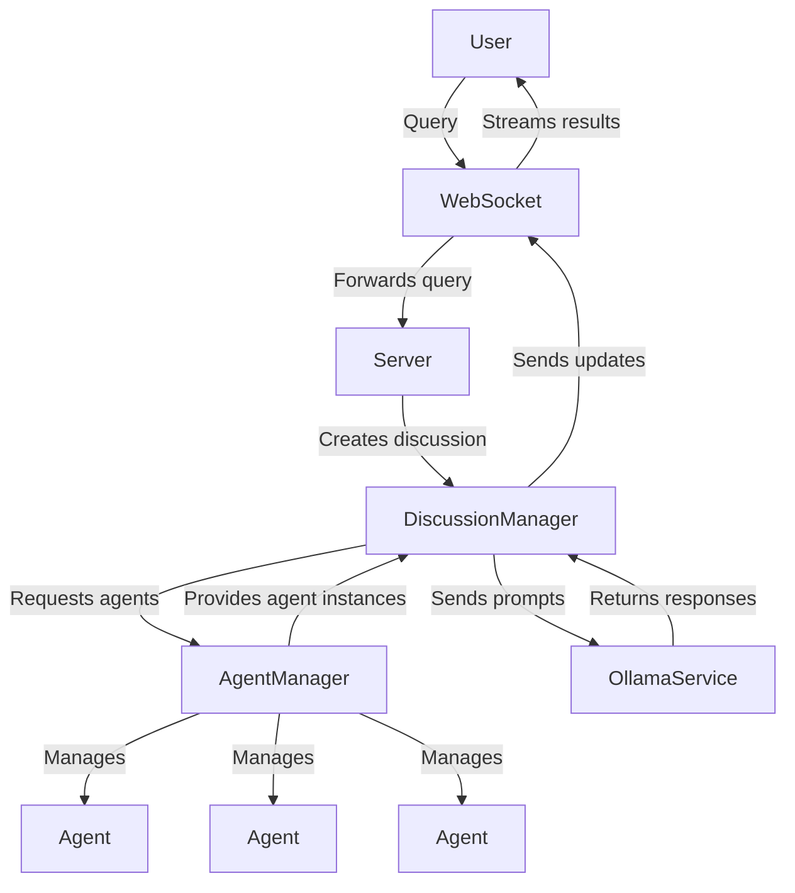

# AI Council - Agent System Technical Documentation

## Overview

The AI Council is a multi-agent system where multiple AI agents with distinct personalities, expertise, and perspectives collaborate to address user queries. This system leverages Ollama's LLM capabilities to facilitate agent-based discussions, leading to more comprehensive and balanced responses.

## Architecture

The system follows a modular design with these key components:



## Core Components

### Server (`server.py`)

The entry point and communication hub for the system.

**Key Responsibilities:**
- Exposes WebSocket endpoints for real-time communication
- Handles incoming user queries
- Initiates and manages discussion sessions
- Routes agent messages back to clients

**Main Classes and Functions:**
- `websocket_endpoint()`: Handles WebSocket connections and incoming messages
- `handle_discussion()`: Processes discussion requests and sends updates

### Agent Manager (`agent_manager.py`)

Responsible for loading, initializing, and providing access to AI agents.

**Key Responsibilities:**
- Loads agent configurations from the file system
- Creates and initializes agent instances
- Provides access to agent information and instances
- Creates default agents when none exist

**Main Methods:**
- `initialize_agents()`: Loads all agent configurations and initializes instances
- `get_agent()`: Retrieves a specific agent by ID
- `get_all_agents()`: Returns all available agents
- `get_agent_info()`: Returns public information about all agents

### Agent (`agent.py`)

Represents an individual AI agent with specific characteristics and capabilities.

**Key Responsibilities:**
- Maintains agent identity (personality, expertise)
- Loads and processes reference materials
- Constructs appropriate prompts for the agent
- Creates agent messages

**Main Methods:**
- `initialize()`: Prepares the agent by loading its references
- `get_system_prompt()`: Generates the complete system prompt for LLM interaction
- `create_message()`: Creates formatted message objects from agent responses

### Discussion Manager (`discussion_manager.py`)

Coordinates discussions between agents and manages the flow of conversation.

**Key Responsibilities:**
- Structures multi-turn discussions between agents
- Tracks discussion state and messages
- Generates consensus responses
- Yields real-time updates to clients

**Main Methods:**
- `run_discussion()`: The core discussion orchestration method
- `_generate_consensus()`: Creates a final consensus response based on agent inputs

### Ollama Service (`ollama_service.py`)

Handles communication with the Ollama LLM service.

**Key Responsibilities:**
- Ensures required models are available
- Formats and sends prompts to the LLM
- Handles response generation and error conditions

**Main Methods:**
- `ensure_model_exists()`: Checks for and downloads models if needed
- `generate_response()`: Formats and sends requests to the LLM

### Models (`models.py`)

Contains data models and types used throughout the system.

**Key Types:**
- `MessageType`: Enumeration of WebSocket message types
- `AgentMessage`: Represents messages from agents
- `Discussion`: Contains the state of an ongoing discussion
- `AgentConfig`: Configuration for an agent
- `AgentInfo`: Public information about an agent

### Constants (`constants.py`)

System-wide configuration settings and constants.

**Key Settings:**
- Model configuration (name, timeouts)
- Discussion parameters (rounds, length limits)
- System prompts
- File handling settings
- Error messages

## Workflow

### System Initialization

1. The server starts and initializes core services:
   - OllamaService verifies the specified LLM model is available
   - AgentManager loads agent configurations and initializes agent instances
   - Each agent loads its reference materials

2. Agent initialization process:
   ```mermaid
   sequenceDiagram
       Server->>AgentManager: initialize_agents()
       AgentManager->>AgentManager: Check for agent directories
       
       alt No agents found
           AgentManager->>AgentManager: _create_default_agents()
           AgentManager->>FileSystem: Create default agent directories
           AgentManager->>FileSystem: Write default config.yml files
       else Agents found
           AgentManager->>FileSystem: Load each agent's config.yml
       end
       
       loop For each agent
           AgentManager->>Agent: Create agent instance
           Agent->>Agent: initialize()
           Agent->>Agent: _load_references()
       end
   ```

### Discussion Flow

1. Client sends a query through the WebSocket connection
2. Server receives the query and creates a discussion task
3. DiscussionManager orchestrates the discussion:
   - Each agent responds to the original query
   - Multiple rounds of inter-agent discussion occur
   - A final consensus is generated

4. Discussion process:
   ```mermaid
   sequenceDiagram
       Client->>Server: Send query via WebSocket
       Server->>DiscussionManager: Create discussion
       
       DiscussionManager->>AgentManager: Get all agents
       AgentManager->>DiscussionManager: Return agent list
       
       loop For each agent (first round)
           DiscussionManager->>OllamaService: Generate response to query
           OllamaService->>DiscussionManager: Return agent response
           DiscussionManager->>Client: Send agent message
       end
       
       loop For MAX_DISCUSSION_ROUNDS-1
           loop For each agent
               DiscussionManager->>DiscussionManager: Format message history
               DiscussionManager->>OllamaService: Generate response to discussion
               OllamaService->>DiscussionManager: Return agent response
               DiscussionManager->>Client: Send agent message
           end
       end
       
       DiscussionManager->>OllamaService: Generate consensus
       OllamaService->>DiscussionManager: Return consensus response
       DiscussionManager->>Client: Send consensus
   ```

## Agent Configuration

Each agent is defined by a configuration file (`config.yml`) in its respective directory under `agent_instances/`:

```yaml
name: Agent Name
description: Brief description of the agent's role
personality: Personality characteristics
expertise:
  - Area of expertise 1
  - Area of expertise 2
temperature: 0.7  # Controls randomness (0.0-1.0)
max_tokens: 1024  # Maximum response length
system_prompt: |
  Additional instructions specific to this agent
```

Agents can also have reference materials in their `references/` directory, which are automatically loaded and included in their context.

## Message Types

The system uses these message types for WebSocket communication:

- `query`: Initial user query
- `agent_message`: Response from an individual agent
- `consensus`: Final consensus response
- `error`: Error information

## Setup and Usage

### Prerequisites

- Python 3.8+
- Ollama installed and running
- Required Python packages: fastapi, uvicorn, pydantic, loguru, PyMuPDF

### Running the System

1. Install dependencies:
   ```
   pip install fastapi uvicorn pydantic loguru pymupdf
   ```

2. Make sure Ollama is running and has access to the required model (default: "llama3:8b")

3. Start the server:
   ```
   python server.py
   ```

4. Connect to the WebSocket endpoint at `ws://localhost:8000/ws`

5. Send a query message:
   ```json
   {
     "type": "query",
     "data": {
       "query": "Your question here",
       "systemInstruction": "Optional additional instruction"
     }
   }
   ```

### Customization

To create a custom agent:

1. Create a new directory under `agent_instances/`
2. Add a `config.yml` file with the agent's configuration
3. Optionally add reference materials in a `references/` subdirectory
4. Restart the server

## Performance and Limitations

- The system is designed for running with local LLM models via Ollama
- Discussion rounds are configurable via `MAX_DISCUSSION_ROUNDS` in constants.py
- Response times depend on the LLM model's speed and complexity of the query
- Reference materials are truncated if they exceed `MAX_REFERENCE_LENGTH`
